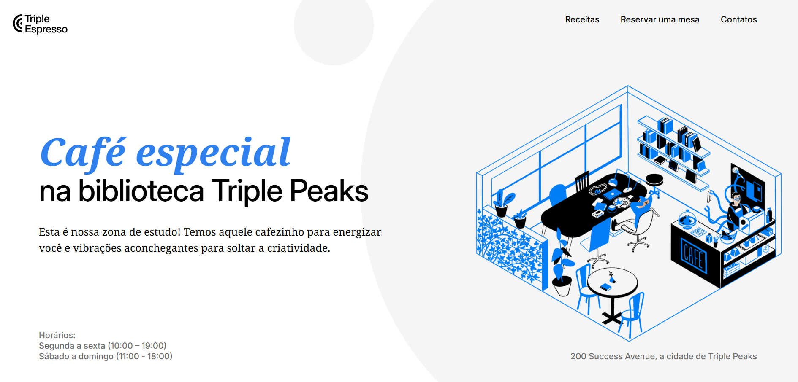
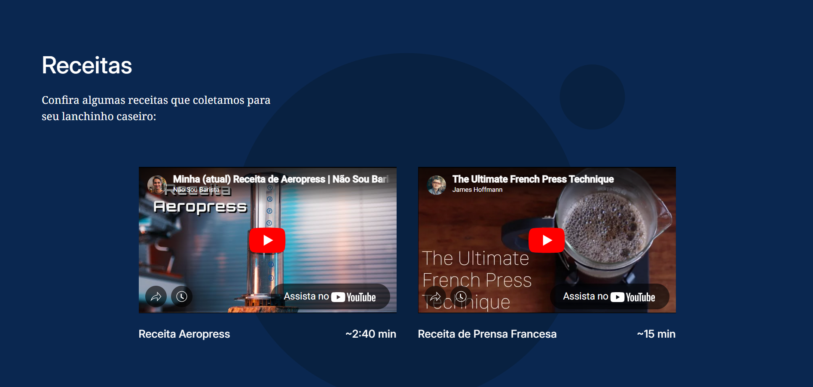
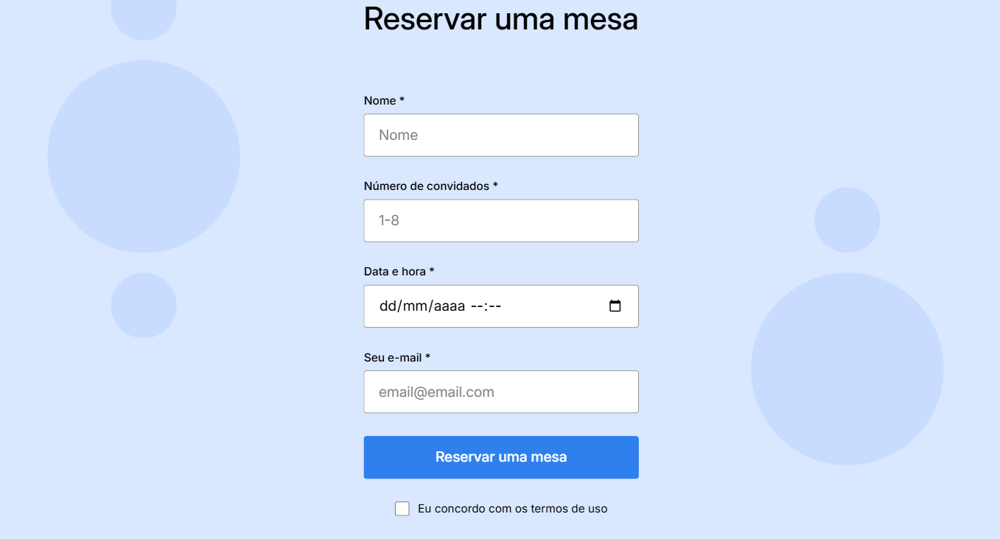
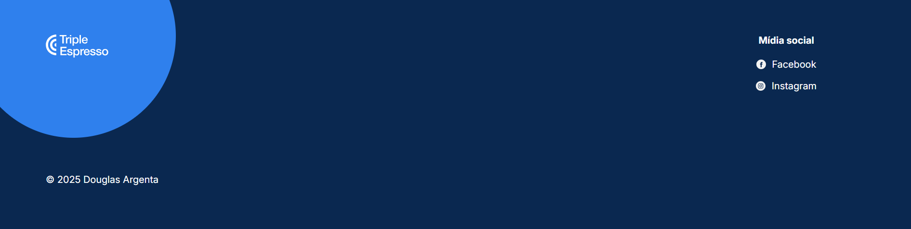

# Projeto Triple Espresso Coffee Shop

## Descrição do Projeto

Este projeto consiste em uma página web para a cafeteria fictícia "Triple Espresso", desenvolvida para aplicar e praticar conceitos de HTML e CSS. A página inclui seções para apresentar a cafeteria, exibir receitas de café, permitir a reserva de mesas através de um formulário e um rodapé com informações de contato e mídias sociais.

As principais tecnologias utilizadas são **HTML5** para a estrutura, **CSS3** para estilização (incluindo Flexbox, posicionamento avançado, tipografia e estados de hover), e **Google Fonts** para as fontes 'Inter' e 'Noto Serif'.

### Visualização do Projeto

Para uma melhor compreensão dos recursos, aqui estão algumas capturas de tela do projeto:

**Header (Seção Principal):**

**Receitas:**

**Formulário de Reserva:**

**Rodapé:**

## Planos de Melhoria

Para futuras iterações e aprimoramento do projeto, planejo explorar:

1.  **Animações e Transições:** Adicionar efeitos visuais dinâmicos em elementos interativos e seções da página.
2.  **Galeria de Imagens:** Criar uma seção de galeria para fotos da cafeteria, utilizando layouts CSS modernos.
